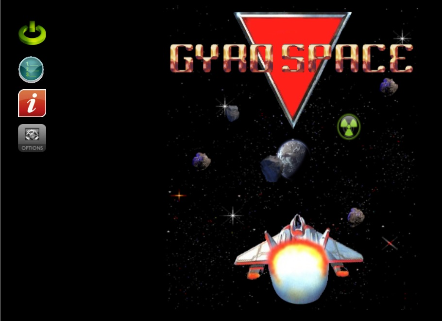

# GyroSpace
GyroSpace is a 2d space game written in C++ and C# initailly as a Windows 8 store app.

The game uses DirectX 11 2d to handle the drawing.

The game loosely resembles the Gyruss arcade game by Konami.

